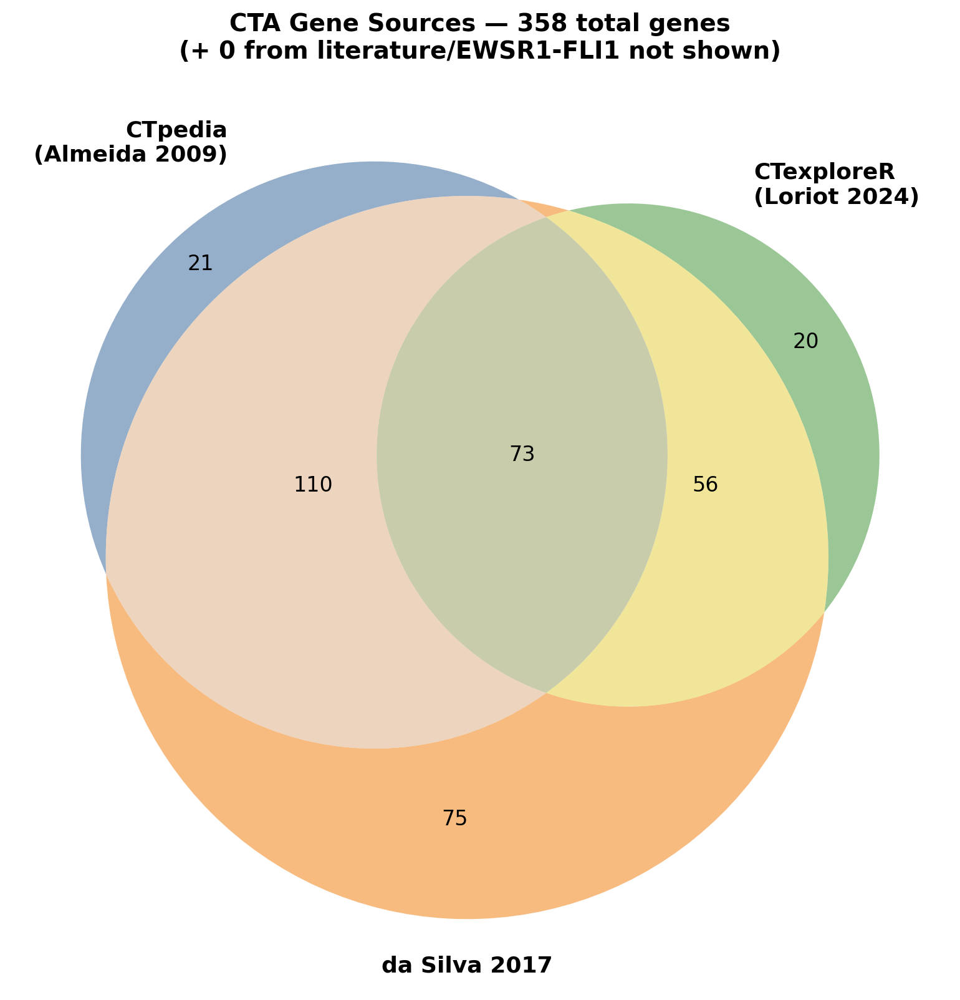
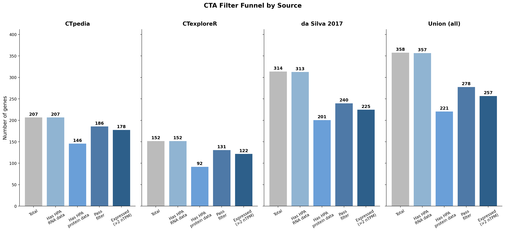
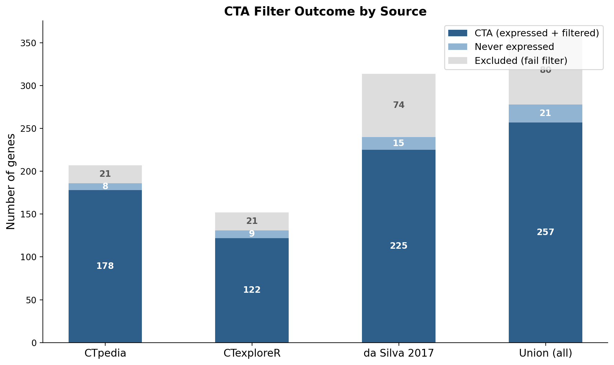
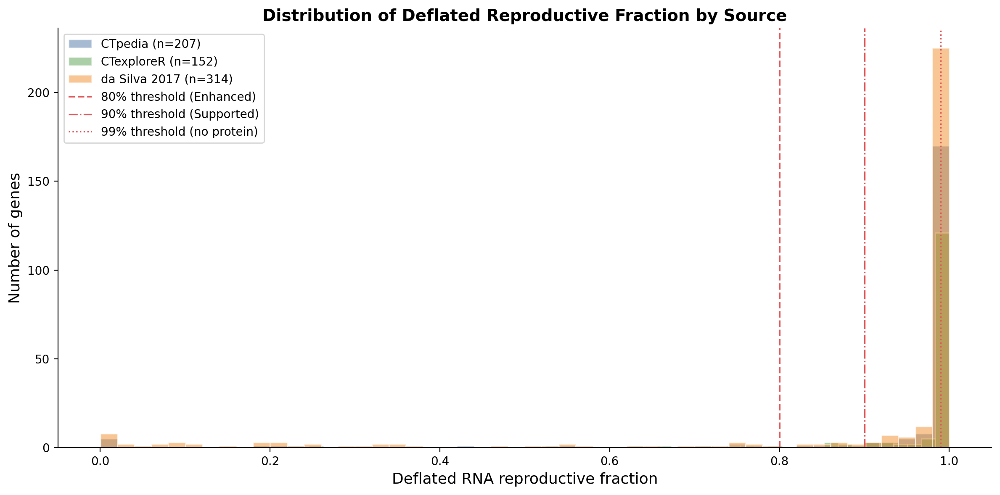
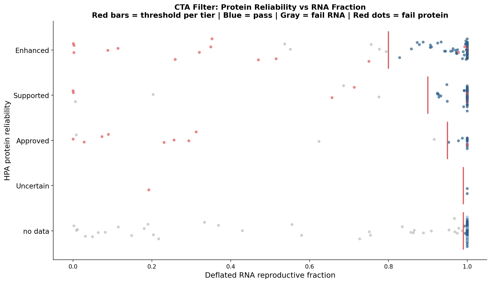

# Cancer-Testis Antigen (CTA) Curation

This document describes how the tsarina CTA gene set is built, filtered, and maintained.

## Figures

### Source overlap


### Filter funnel by source


### Filter outcome by source


### Deflated reproductive fraction distribution


### Protein reliability vs RNA fraction


## Overview

Cancer-testis antigens (CTAs) are proteins normally restricted to reproductive tissues (testis, ovary, placenta) that become aberrantly expressed in tumors. Their tissue restriction makes them attractive targets for cancer immunotherapy because immune responses against them should not damage normal somatic tissues.

The tsarina CTA set is built as an **unbiased union** from multiple published CT antigen databases, then **systematically filtered** using Human Protein Atlas tissue expression data to retain only genes with reproductive-restricted expression.

## Source databases

### CTpedia (167 genes)

The [CTdatabase/CTpedia](http://www.cta.lncc.br/) is the foundational CT antigen reference, maintained by the Ludwig Institute for Cancer Research.

- **Publication**: [Almeida et al. 2009, *Nucleic Acids Research*](https://doi.org/10.1093/nar/gkn673)
- **Content**: ~279 CT gene families curated from literature, with expression data, immune response data, and PubMed links
- **Our subset**: 167 genes from CTpedia that had HPA tissue antibody staining restricted to testis and placenta (original pirlygenes CTA list)

### CTexploreR / CTdata (62 new genes)

[CTexploreR](https://www.bioconductor.org/packages/release/bioc/html/CTexploreR.html) is a modern Bioconductor R package providing a curated, actively maintained CT gene list based on GTEx, CCLE, TCGA, and ENCODE data.

- **Publication**: [Loriot et al. 2025, *PLOS Genetics*](https://doi.org/10.1371/journal.pgen.1011734)
- **Content**: 280 genes classified as CT_gene (146, testis-specific) or CTP_gene (134, testis-preferential)
- **Classification criteria**: Testis-specific genes must have low expression in all somatic tissues and >=10x higher expression in testis. Testis-preferential genes must have low expression in >=75% of somatic tissues with >=10x testis enrichment. Both must show activation in cancer cell lines (CCLE) and tumors (TCGA).
- **Our subset**: 62 protein-coding CTexploreR genes not already in CTpedia that pass our HPA filter. Source tagged as `CTexploreR_CT` or `CTexploreR_CTP`.
- **GitHub**: [UCLouvain-CBIO/CTdata](https://github.com/UCLouvain-CBIO/CTdata)

### da Silva et al. 2017 protein-level CT genes (89 new genes)

[da Silva et al. 2017](https://doi.org/10.18632/oncotarget.21715) performed genome-wide identification of CT genes using RNA-seq across multiple normal tissue datasets and validated a subset at the protein level using tumor mass spectrometry proteomics.

- **Publication**: [da Silva et al. 2017, *Oncotarget*](https://doi.org/10.18632/oncotarget.21715)
- **Full predicted set**: 1,103 testis-biased genes (proportional score >= 0.9)
- **Protein-level subset**: 136 genes detected by mass spectrometry in tumor samples (melanoma, colorectal, breast, prostate, ovary — 209 samples total). These are genes with direct evidence of protein expression in tumors.
- **Our subset**: 135 of the 136 protein-level genes (1 excluded: SPATA8 reclassified as lncRNA in Ensembl 112). 46 overlap existing genes, 89 new. Source tagged as `daSilva2017_protein`.
- **Note**: The full 1,103-gene set uses a broad 0.9 proportional score threshold. The paper also describes a stricter 0.99 threshold (478 genes) and S-score tumor expression filter (418 genes), but these subsets are not provided as downloadable supplementary data. We use only the 136 protein-level genes, which represent the highest-confidence subset with direct proteomic evidence.

### EWSR1-FLI1 CT gene binding sites (12 genes)

CT genes identified as having EWSR1-FLI1 transcription factor binding sites in Ewing sarcoma.

- **Publication**: [Gallegos et al. 2019, *Molecular and Cellular Biology*](https://doi.org/10.1128/MCB.00138-19)
- **Content**: 40 CT genes from Table 2. 15 already in CTpedia, 12 new additions, 13 broadly expressed (excluded).

### Literature scan (28 genes)

Testis-specific genes from meiosis, piRNA pathway, and spermatogenesis literature that pass the HPA reproductive-tissue filter. These include well-characterized testis-specific gene families not captured by the databases above:

- Synaptonemal complex: SYCP3, SMC1B, RAD21L1, SYCE2, MEIOB, FKBP6
- piRNA pathway: PIWIL1, MAEL, DDX4
- Spermatogenesis: BRDT, LDHC, BOLL, NANOS2, ZPBP, ZPBP2, CALR3, ACTL7A, ACTL7B, DMRTB1
- Pluripotency: DPPA3, DPPA5, UTF1
- Known CT antigens: MAGEA8, MAGEA12, MAGEB10, GAGE1, PASD1, TEX14

## Other CT databases considered

Several additional databases were evaluated but not used as primary sources:

| Database | Genes | Why not included directly |
|---|---|---|
| [da Silva et al. 2017](https://doi.org/10.18632/oncotarget.21715) full set | 1,103 | Broad 0.9 threshold; only the 136 protein-level subset used |
| [Wang et al. 2016](https://doi.org/10.1038/ncomms10499) | 876 | Genome-wide screen; supplementary gene lists overlap with other sources |
| [Bruggeman et al. 2018](https://doi.org/10.1038/s41388-018-0357-2) | 756 | Germ cell-specific genes; broader than classic CTA definition |
| [MSigDB YOKOE set](https://www.gsea-msigdb.org/gsea/msigdb/cards/YOKOE_CANCER_TESTIS_ANTIGENS) | 35 | Small, fully covered by CTpedia |
| [HPA testis-elevated](https://www.proteinatlas.org/humanproteome/tissue/testis) | 1,994 | Testis-elevated, not CTA-specific |

Genes from these sources are cross-referenced in the `source_databases` column (e.g., `daSilva2017` tag indicates the gene appears in the da Silva full 1,103-gene set).

## HPA tissue expression annotation

Every gene is scored against [Human Protein Atlas](https://www.proteinatlas.org/) v23 using two data modalities:

### RNA expression

**Data source**: [HPA RNA tissue consensus](https://www.proteinatlas.org/about/download) (`rna_tissue_consensus.tsv`)

This dataset provides normalized transcripts per million (nTPM) values across **50 normal human tissues**, representing a consensus of RNA-seq data from HPA, GTEx, and FANTOM5.

**Core reproductive tissues**: testis, ovary, placenta

**Thymus exclusion**: Thymus is excluded from all restriction calculations because AIRE (autoimmune regulator) drives ectopic expression of tissue-restricted antigens in medullary thymic epithelial cells (mTECs) as part of central immune tolerance. CTA expression in thymus is expected and does not indicate somatic tissue leakage.

**Deflated reproductive fraction**: To suppress low-level basal transcription noise, we compute a deflated metric:

```
deflated_fraction = (1 + sum_reproductive(max(0, nTPM - 1))) / (1 + sum_all(max(0, nTPM - 1)))
```

- `max(0, nTPM - 1)` zeros out sub-1 nTPM values (below HPA's own detection threshold)
- The `+1` pseudocount on numerator and denominator prevents 0/0 for very-low-expression genes where all tissues have nTPM < 1
- Thymus is excluded from the denominator (sum_all)

**Example**: CTCFL/BORIS has testis nTPM = 10.8 but ~40 other tissues at 0.1-0.9 nTPM each. Raw reproductive fraction: 54%. Deflated fraction: 100% (only testis exceeds 1 nTPM, so all other tissues contribute 0 after deflation).

### Protein expression

**Data source**: [HPA normal tissue IHC](https://www.proteinatlas.org/about/download) (`normal_tissue.tsv`)

This dataset provides immunohistochemistry (IHC) staining levels across **63 normal human tissues** with antibody reliability scores.

**Detection levels**: Not detected, Low, Medium, High

**Antibody reliability** (highest to lowest confidence):
- **Enhanced**: Orthogonal validation (mass spectrometry, Western blot, or similar)
- **Supported**: Staining consistent with gene/protein characterization
- **Approved**: Basic validation passed (at least one cell type detected as expected)
- **Uncertain**: Contradictory or unreliable staining pattern

A gene's `protein_reproductive` flag is True when all tissues with detected protein (excluding thymus) are in {testis, ovary, placenta}. The `protein_reliability` column reports the best (highest confidence) reliability score across all antibodies for that gene.

## Filter logic

The `filtered` column uses tiered deflated RNA reproductive fraction thresholds that scale with protein data confidence. Higher-confidence protein data in reproductive tissues provides corroborating evidence, allowing a more permissive RNA threshold:

| Protein evidence | Required deflated RNA fraction |
|---|---|
| Enhanced (orthogonal validation) + reproductive only | >= 80% |
| Supported (consistent characterization) + reproductive only | >= 90% |
| Approved (basic validation) + reproductive only | >= 95% |
| Uncertain or no protein data available | >= 99% |

**Additional filter criteria**:
- Gene must be protein-coding (Ensembl biotype = `protein_coding`)
- Genes with protein detected in **non-reproductive tissues** (excluding thymus) always fail, regardless of RNA fraction
- Thymus is excluded from both RNA and protein restriction checks

## Three-axis CTA tier system

Every filtered CTA gene is classified along three independent axes: **restriction** (what tissues), **evidence** (how confident), and **ms_safety** (MS evidence in healthy tissue).

### Axis 1: `restriction` — tissue restriction category

Based on IHC protein expression (`protein_strict_expression`). For genes with no protein data, falls back to RNA evidence.

| Value | Count | Criteria | Clinical implication |
|-------|-------|----------|---------------------|
| `TESTIS` | 151 | IHC protein detected only in testis | Serum biomarker for anyone (blood-testis barrier) |
| `PLACENTAL` | 19 | IHC protein in placenta ± testis (no ovary) | Biomarker for non-pregnant individuals |
| `OVARIAN` | 4 | IHC protein includes ovary | Biomarker for males |
| `RNA_ONLY` | 83 | No IHC data; RNA says reproductive-restricted | Restriction category uncertain |

Never-expressed and unfiltered genes receive an empty `restriction`.

**Serum biomarker rationale**: The blood-testis barrier (Sertoli cell tight junctions) sequesters testicular proteins from circulation. Placental proteins can leak into maternal blood (hCG, AFP). Ovarian proteins may reach circulation during ovulation. The `TESTIS` restriction is the most clinically actionable for liquid biopsy development.

### Axis 2: `evidence` — evidence quality

| Value | Count | Criteria |
|-------|-------|----------|
| `PROTEIN_STRICT` | 105 | Enhanced/Supported IHC + `rna_reproductive` True + deflated frac ≥ 0.99 |
| `RNA_STRICT` | 76 | No IHC + `rna_reproductive` True + deflated frac ≥ 0.99 |
| `ADAPTIVE` | 76 | Passes adaptive threshold (protein quality compensates for RNA noise) |
| `NEVER_EXPRESSED` | 24 | No meaningful HPA signal (no protein + max RNA < 2 nTPM) |

### Axis 3: `ms_safety` — MS evidence classification

Computed at runtime from IEDB/CEDAR data via hitlist; defaults to `NO_MS_DATA` in the shipped CSV.

| Value | Criteria |
|-------|----------|
| `CANCER_ONLY` | Gene's peptides found only in cancer MS; zero healthy somatic tissue hits |
| `EXPECTED_TISSUE` | MS hits only in reproductive/thymic tissue (expected for CTAs) |
| `SINGLETON_HEALTHY` | 1 peptide in ≤ 1 healthy somatic tissue (possible noise) |
| `RECURRENT_HEALTHY` | Multiple peptides or tissues in healthy somatic MS (genuine off-target) |
| `NO_MS_DATA` | No MS evidence available for this gene's peptides |

### Axis-aware API

```python
from tsarina import (
    CTA_testis_restricted_gene_names,     # 151 genes
    CTA_placental_restricted_gene_names,  # 19 genes
    CTA_by_axes,                          # flexible multi-axis filter
    RESTRICTION_VALUES, EVIDENCE_VALUES, MS_SAFETY_VALUES,
)

# Testis-restricted with strict protein evidence
strict_testis = CTA_by_axes(restriction="TESTIS", evidence="PROTEIN_STRICT")

# All testis + placental genes (serum biomarkers for non-pregnant)
biomarkers = CTA_by_axes(restriction={"TESTIS", "PLACENTAL"})

# Evidence table — filter by any combination
from tsarina import CTA_evidence
df = CTA_evidence()
testis_strict = df[(df["restriction"] == "TESTIS") & (df["evidence"] == "PROTEIN_STRICT")]

# Full per-tissue detail (requires HPA data files)
from tsarina import CTA_detailed_evidence
detailed = CTA_detailed_evidence(hpa_bulk_path="proteinatlas.tsv")
# Adds: rna_testis_ntpm, rna_ovary_ntpm, rna_placenta_ntpm,
#        rna_max_somatic_tissue, rna_max_somatic_ntpm, rna_somatic_detected_count
```

## Never-expressed flag

The `never_expressed` column flags genes where:
- No HPA protein (IHC) data is available, AND
- Maximum RNA nTPM across all tissues is < 2

These genes pass the filter (because the `+1` pseudocount gives a 1.0 deflated fraction when all nTPMs are below 1), but the evidence for their tissue restriction is weak — HPA simply doesn't have enough signal to confirm or deny reproductive specificity. They are typically very low-abundance transcripts below HPA's detection sensitivity. Many are still legitimate CTAs supported by other evidence (e.g., CTpedia listing, tumor mass spectrometry detection), but users should be aware of the limited HPA evidence.

Currently **24 genes** are flagged as low evidence.

## Gene symbol maintenance

Gene symbols are updated to current HGNC nomenclature, with old symbols preserved in the `Aliases` column. Known renames:

| Old symbol | Current symbol | Reason |
|---|---|---|
| TSPY9P | TSPY9 | Reclassified from pseudogene to protein-coding |
| ODF3 | ODF3 (alias: CIMAP1A) | Renamed in Ensembl 112 |
| TEX33 | TEX33 (alias: CIMIP4) | Renamed in Ensembl 112 |
| TEX37 | TEX37 (alias: SPMIP9) | Renamed in Ensembl 112 |
| THEG | THEG (alias: SPMAP2) | Renamed in Ensembl 112 |
| C17orf104 | TLCD3A | HGNC rename |
| CCDC155 | KASH5 | HGNC rename |
| FAM71E2 | GARIN4 | HGNC rename |
| HIST1H1A | H1-1 | Histone nomenclature update |
| HIST1H1T | H1-6 | Histone nomenclature update |
| HIST1H2BA | H2BC1 | Histone nomenclature update |
| HIST1H2BB | H2BC3 | Histone nomenclature update |
| HIST1H4F | H4C6 | Histone nomenclature update |

All Ensembl Gene IDs are validated against Ensembl release 112. Canonical transcript IDs (longest protein-coding transcript) are provided in the `Canonical_Transcript_ID` column.

## Column reference

| Column | Description |
|---|---|
| `Symbol` | Current HGNC gene symbol |
| `Aliases` | Previous/alternative gene symbols (semicolon-separated) |
| `Full_Name` | Gene full name |
| `Function` | Functional annotation |
| `Ensembl_Gene_ID` | Ensembl gene ID (validated against release 112) |
| `source_databases` | Source databases (CTpedia, CTexploreR_CT, CTexploreR_CTP, daSilva2017, daSilva2017_protein) |
| `protein_reproductive` | IHC detected only in {testis, ovary, placenta} (excl. thymus), or `"no data"` |
| `protein_thymus` | IHC detected in thymus |
| `protein_reliability` | Best HPA antibody reliability (Enhanced / Supported / Approved / Uncertain / `"no data"`) |
| `rna_reproductive` | All tissues with >=1 nTPM (excl. thymus) are in {testis, ovary, placenta} |
| `rna_thymus` | Thymus nTPM >= 1 |
| `protein_strict_expression` | Semicolon-separated tissues with IHC detection (excl. thymus) |
| `rna_reproductive_frac` | Fraction of total nTPM (excl. thymus) in core reproductive tissues |
| `rna_reproductive_and_thymus_frac` | Same, with thymus added to numerator and denominator |
| `rna_deflated_reproductive_frac` | `(1 + sum_repro(max(0, nTPM-1))) / (1 + sum_all(max(0, nTPM-1)))` |
| `rna_deflated_reproductive_and_thymus_frac` | Same, with thymus added to reproductive numerator |
| `Canonical_Transcript_ID` | Longest protein-coding transcript (Ensembl 112) |
| `biotype` | Ensembl gene biotype (must be `protein_coding` to pass filter) |
| `rna_max_ntpm` | Maximum nTPM across all tissues |
| `rna_80_pct_filter` | Deflated reproductive fraction >= 80% |
| `rna_90_pct_filter` | Deflated reproductive fraction >= 90% |
| `rna_95_pct_filter` | Deflated reproductive fraction >= 95% |
| `rna_99_pct_filter` | Deflated reproductive fraction >= 99% |
| `filtered` | Final inclusion flag (see filter logic above) |
| `never_expressed` | No HPA protein data AND max RNA nTPM < 2 |
| `restriction` | Tissue restriction axis: `TESTIS`, `PLACENTAL`, `OVARIAN`, `RNA_ONLY`, or empty |
| `evidence` | Evidence quality axis: `PROTEIN_STRICT`, `RNA_STRICT`, `ADAPTIVE`, `NEVER_EXPRESSED`, or empty |
| `protein_testis` | IHC protein detected in testis (`True`/`False`/empty if no data) |
| `protein_ovary` | IHC protein detected in ovary (`True`/`False`/empty if no data) |
| `protein_placenta` | IHC protein detected in placenta (`True`/`False`/empty if no data) |
| `ms_safety` | MS safety axis: `NO_MS_DATA` (default); `CANCER_ONLY`, `EXPECTED_TISSUE`, `SINGLETON_HEALTHY`, `RECURRENT_HEALTHY` when computed at runtime |

## Python API

```python
from pirlygenes.gene_sets_cancer import (
    CTA_gene_names,                # expressed + filtered CTAs (recommended default)
    CTA_gene_ids,                  # same, as Ensembl gene IDs
    CTA_never_expressed_gene_names,# filter-passing but no HPA expression
    CTA_filtered_gene_names,       # all filter-passing (= expressed + never_expressed)
    CTA_excluded_gene_names,       # CTAs that FAIL filter (somatic expression)
    CTA_unfiltered_gene_names,     # full CTA universe (all source databases)
    CTA_evidence,                  # full DataFrame with all evidence columns
    CTA_partition,                 # partition ALL protein-coding genes
)

# Default: expressed, reproductive-restricted CTAs
cta_genes = CTA_gene_names()

# Full CTA universe (for excluding from non-CTA comparison sets)
all_ctas = CTA_unfiltered_gene_names()

# Evidence table — filter however you like
df = CTA_evidence()

# Example: strict CTAs from CTpedia with Enhanced protein evidence
strict = df[
    (df['filtered'] == True) &
    (df['source_databases'].str.contains('CTpedia')) &
    (df['protein_reliability'] == 'Enhanced') &
    (~df['never_expressed'])
]

# Example: genes with tumor mass spec evidence
tumor_protein = df[df['source_databases'].str.contains('daSilva2017_protein', na=False)]
```

## Gene partitioning for pMHC analysis

When comparing CTA pMHCs against non-CTA pMHCs, every protein-coding gene needs to go into exactly one bucket. `CTA_partition()` handles this:

```python
from pirlygenes.gene_sets_cancer import (
    CTA_partition_gene_ids,       # sets of Ensembl gene IDs
    CTA_partition_gene_names,     # sets of gene symbols
    CTA_partition_dataframes,     # DataFrames with evidence columns
)

# Each returns a dataclass with .cta, .cta_never_expressed, .non_cta
p = CTA_partition_gene_ids()
p.cta                   # set of Ensembl IDs for expressed CTAs
p.cta_never_expressed   # set of Ensembl IDs for never-expressed CTAs
p.non_cta               # set of Ensembl IDs for everything else

p = CTA_partition_gene_names()
"MAGEA4" in p.cta       # True
"TP53" in p.non_cta     # True

p = CTA_partition_dataframes()
p.cta.columns           # full evidence columns for CTAs
p.non_cta.columns       # Symbol, Ensembl_Gene_ID
```

| Partition | Description | Typical count |
|---|---|---|
| `p.cta` | Expressed, reproductive-restricted CTAs. Source of CTA pMHCs. | ~257 |
| `p.cta_never_expressed` | CTAs from databases but no meaningful HPA expression (max nTPM < 2, no protein data). Pass filter on a technicality (pseudocount). Separate from analysis. | ~21 |
| `p.non_cta` | All other protein-coding genes, **including** CTAs that fail the reproductive-tissue filter (somatic expression). Clean non-CTA comparison set. | ~19,800 |

These three sets are **non-overlapping** and their union covers all protein-coding genes from Ensembl.

**Why three partitions instead of two?**
- **Never-expressed CTAs** pass our filter because the +1 pseudocount gives them a 1.0 deflated fraction when all nTPMs are below 1. They are in CT antigen databases but HPA has no real signal. Including them in pMHC analysis would add noise — you can't target a protein that's never made.
- **Excluded CTAs** (those that fail the filter due to somatic expression) are folded into `non_cta`. They express in healthy tissue, so their peptides would appear in the non-CTA proteome anyway. Keeping them in `non_cta` gives a realistic comparison set.
