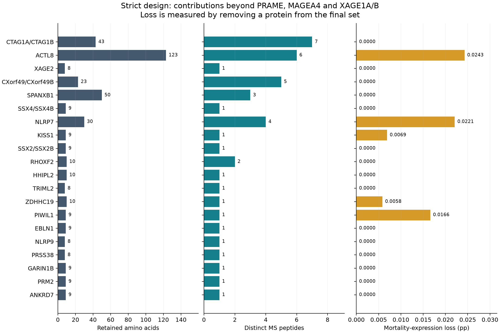
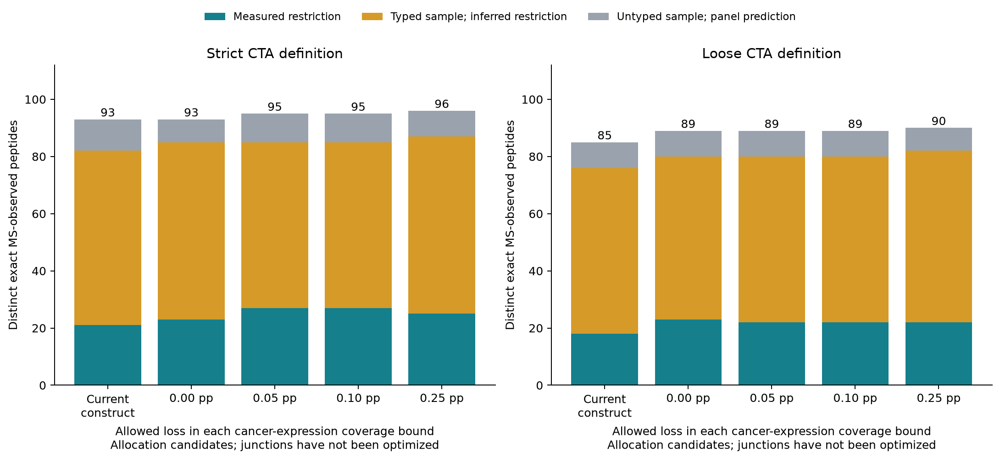

# Comparing CTA coverage and MS evidence

A protein earns space by what its retained regions add: cancer-expression coverage, observed ligands, and HLA support for the target. A small positive expression score alone is not sufficient justification for choosing it over an MS-rich region of a common CTA.

This analysis compares the [published 2.5-kb designs](vaccine-results/index.html) with alternative **segment allocations**. The alternatives are not assembled vaccine constructs: their segment order, junctional binding, cleavage, linkers and junctional normal-tissue 8-mers have not been optimized or validated. The published constructs remain the current designs.

## Do additional PRAME regions broaden HLA support?

Yes. More PRAME regions add exact MS-observed peptides and supported presenters **for PRAME**, even when those alleles are already represented by another protein. MS observation confirms the peptide; many HLA assignments remain inferred from affinity predictions.

| Scope | PRAME regions | MS peptides | All HLA | Typed HLA | Measured HLA |
| --- | --- | ---: | ---: | ---: | ---: |
| Strict | Retained | 23 | 46 | 30 | 8 |
| Strict | All qualifying | 56 | 48 | 34 | 11 |
| Loose | Retained | 10 | 40 | 21 | 4 |
| Loose | All qualifying | 56 | 48 | 34 | 11 |

Strict PRAME can add **33 observed peptides** and two presenters, **HLA-A*01:01 and HLA-A*68:01**. Loose can add 46 peptides and eight presenters. These additions do not change the current global allele union, because other proteins already support those alleles. They do broaden support for PRAME. The totals describe all qualifying regions, not an addition that fits into the already full construct.

Typing-supported includes measured restriction and affinity-based inference within a typed sample. Measured restriction follows the report’s monoallelic-MS evidence tier. Untyped samples can qualify through panel prediction under the configured policy.

## What do the additional proteins contribute?

The current expression objective uses the maximum measured p95 prevalence across selected proteins for each cancer, weighted by global mortality or incidence shares. This is a conservative union lower bound from marginal expression data; it is not patient overlap, clinical protection or preventable mortality. Removal losses are conditional on the final set and are not additive.

| Definition | Current proteins | Mortality-expression lower bound | PRAME + MAGEA4 + XAGE1A/B alone | Collective gain from other proteins |
| --- | ---: | ---: | ---: | ---: |
| Strict | 23 | 13.380040 pp | 13.276395 pp | 0.103645 pp |
| Loose | 26 | 13.383674 pp | 13.276395 pp | 0.107279 pp |

The strict design’s other 20 proteins collectively add only **0.103645 percentage points** to that mortality-weighted expression lower bound. Some add valuable observed peptides or presenters. Others have no unique global allele or expression contribution once the final set is considered; their justification must come from evidence yield, target-specific HLA support, or a coverage assumption that is stated explicitly.

Additional proteins include established CTAs such as CTAG1A/CTAG1B. Zero marginal
lower-bound gain does not mean a protein is rare or reaches no additional patients.
The model cannot resolve expression overlap between proteins: complementary
patient populations may increase actual coverage without changing this bound.
Rarity alone is not an exclusion gate.



### Strict: every retained protein

| Protein / identical-sequence group | aa | Pieces | Distinct MS peptides | Mortality-expression removal loss (pp) | Incidence-expression removal loss (pp) | Global alleles uniquely lost |
| --- | ---: | ---: | ---: | ---: | ---: | --- |
| XAGE1A/XAGE1B | 32 | 1 | 2 | 5.731588 | 3.691344 | None |
| MAGEA4 | 112 | 4 | 27 | 1.169170 | 1.162587 | None |
| PRAME | 139 | 5 | 23 | 1.759744 | 3.206828 | HLA-A*24:02, HLA-B*46:01 |
| CTAG1A/CTAG1B | 43 | 1 | 7 | 0.000000 | 0.000000 | None |
| ACTL8 | 123 | 1 | 6 | 0.024282 | 0.025065 | None |
| XAGE2 | 8 | 1 | 1 | 0.000000 | 0.000000 | None |
| CXorf49/CXorf49B | 23 | 1 | 5 | 0.000000 | 0.000000 | None |
| SPANXB1 | 50 | 1 | 3 | 0.000000 | 0.000000 | HLA-A*33:01 |
| SSX4/SSX4B | 9 | 1 | 1 | 0.000000 | 0.000000 | None |
| NLRP7 | 30 | 3 | 4 | 0.022078 | 0.110390 | None |
| KISS1 | 9 | 1 | 1 | 0.006897 | 0.003448 | None |
| SSX2/SSX2B | 9 | 1 | 1 | 0.000000 | 0.000000 | None |
| RHOXF2 | 10 | 1 | 2 | 0.000000 | 0.000000 | None |
| HHIPL2 | 10 | 1 | 1 | 0.000000 | 0.000000 | HLA-A*11:01 |
| TRIML2 | 8 | 1 | 1 | 0.000000 | 0.000000 | None |
| ZDHHC19 | 10 | 1 | 1 | 0.005844 | 0.005844 | None |
| PIWIL1 | 9 | 1 | 1 | 0.016602 | 0.136133 | None |
| EBLN1 | 9 | 1 | 1 | 0.000000 | 0.000000 | None |
| NLRP9 | 8 | 1 | 1 | 0.000000 | 0.000000 | None |
| PRSS38 | 8 | 1 | 1 | 0.000000 | 0.000000 | None |
| GARIN1B | 9 | 1 | 1 | 0.000000 | 0.000000 | HLA-B*53:01, HLA-B*58:01 |
| PRM2 | 9 | 1 | 1 | 0.000000 | 0.000000 | None |
| ANKRD7 | 9 | 1 | 1 | 0.000000 | 0.000000 | None |

Zero global allele loss does not imply zero target-specific HLA benefit. The complete strict and loose tables also include the change in the HLA carrier proxy; see the CSV downloads below.

## Same-budget alternatives

The comparison maximizes distinct exact MS-observed peptides under the 686-aa / 2,500-nt limits, then favors fewer proteoforms, fewer contiguous pieces and less sequence. It permits a stated loss in **each** mortality- and incidence-weighted expression lower bound. A tolerance is an analysis choice, not a clinically validated threshold.

Every alternative preserves the current strongest restriction tier for each globally supported allele. It also preserves that tier for every currently supported PRAME, MAGEA4 and XAGE1A/B allele. This prevents a global allele count from concealing weaker HLA support for a common target. These constraints preserve the current known support; they do not model joint cancer/HLA patient coverage.

All alternatives use whole CTA-specific pieces, trimmed to the span of their qualifying ligands. One initiating methionine is reserved. The reported RNA length includes the existing 441-nt UTR/polyA/stop overhead. Padding and linkers would need space during subsequent junction optimization.

| Definition | Allowed loss in each expression bound (pp) | Proteoforms | Pieces | Distinct MS peptides | PRAME peptides / aa | Mortality lower (pp) | Incidence lower (pp) | RNA nt before junction optimization |
| --- | ---: | ---: | ---: | ---: | ---: | ---: | ---: | ---: |
| Strict | 0.00 | 19 | 31 | 93 | 23 / 138 | 13.380040 | 12.613961 | ≤2499 |
| Strict | 0.05 | 11 | 18 | 95 | 49 / 305 | 13.340333 | 12.581635 | ≤2493 |
| Strict | 0.10 | 11 | 18 | 95 | 49 / 305 | 13.340333 | 12.581635 | ≤2493 |
| Strict | 0.25 | 10 | 17 | 96 | 49 / 305 | 13.323732 | 12.445502 | ≤2487 |
| Loose | 0.00 | 18 | 25 | 89 | 23 / 138 | 13.383674 | 12.616287 | ≤2490 |
| Loose | 0.05 | 13 | 19 | 89 | 36 / 223 | 13.340333 | 12.581635 | ≤2487 |
| Loose | 0.10 | 13 | 19 | 89 | 36 / 223 | 13.340333 | 12.581635 | ≤2487 |
| Loose | 0.25 | 13 | 19 | 90 | 36 / 223 | 13.323732 | 12.445502 | ≤2490 |



At zero tolerated expression loss, strict retains the same 93 observed peptides with 19 proteins rather than 23; loose reaches 89 rather than 85 peptides with 18 rather than 26 proteins. Allowing 0.05 pp in each expression bound permits a strict allocation with 11 proteins, 95 observed peptides and 49 PRAME peptides. These are candidates for a fresh construct-design run, not replacements for the published antigen.

## Sources, method and reproducibility

The inputs are the published strict/loose report’s `ranking.csv`, `specific_intervals.csv`, `ms_assignments.csv`, `cancer_summary.csv.gz`, `ligands.csv`, and `data.json`. Input SHA256 values are recorded in each result. The underlying snapshots use Hitlist 1.66.0 positive-MS evidence, OncoRef cancer/CTA references, Ensembl 112 sequences, the verified HLA Ligand Atlas 2020.12 normal-tissue exclusions, and CIWD Table A2 allele frequencies. See [the design methods](vaccine-design.md) and [source validation](vaccine-validation.md) for provenance and assumptions.

A mixed-integer allocation model uses binary segment/proteoform/peptide indicators. Per-cancer prevalence levels encode the maximum complete measured prevalence. The solver first maximizes unique observed-peptide count, then minimizes protein count, piece count and length using bounded objective weights. All eight runs reached the solver’s optimum, with numerical gaps below 1e-12. This establishes an optimum for this allocation model and candidate pool, not for joint presentation, clinical coverage or junction-aware vaccine design.

Independent verification rechecks native coordinates, exact positive-MS evidence and allele assignments, length accounting, coverage calculations, restriction-tier constraints, normal-tissue 8-mers and the non-CTA proteome. It does not validate synthetic junctions because no new concatenated antigen has been generated.

Run the repository’s [`scripts/analyze_vaccine_tradeoffs.py`](https://github.com/pirl-unc/tsarina/blob/main/scripts/analyze_vaccine_tradeoffs.py) with the saved report downloads and its `data.json`; SciPy with `optimize.milp` is required:

```bash
python scripts/analyze_vaccine_tradeoffs.py \
  --input-root docs/vaccine-results/downloads \
  --report-json docs/vaccine-results/data.json \
  --output-dir /tmp/tsarina-tradeoffs
```

The `--global-union-only` comparison relaxes target/tier protection to expose why a high global allele count can hide weaker evidence for a target. It should not be interpreted as preserving target-specific reach.

## Downloads

- [Strict allocation results and input hashes](vaccine-tradeoffs/strict.json)
- [Loose allocation results and input hashes](vaccine-tradeoffs/loose.json)
- [Strict per-protein contributions](vaccine-tradeoffs/strict-protein-contributions.csv)
- [Loose per-protein contributions](vaccine-tradeoffs/loose-protein-contributions.csv)
- [Independent verification](vaccine-tradeoffs/independent-validation.json)
- [Evidence-yield figure (SVG)](vaccine-tradeoffs/ms-evidence-tradeoffs.svg)
- [Additional-protein contributions figure (SVG)](vaccine-tradeoffs/strict-additional-proteins.svg)
