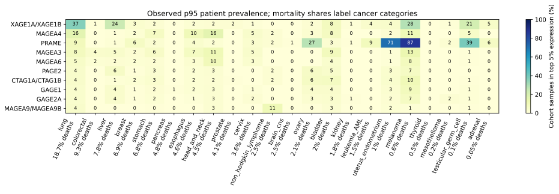
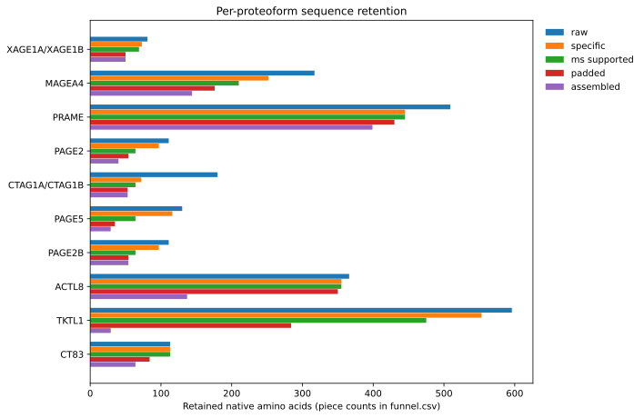
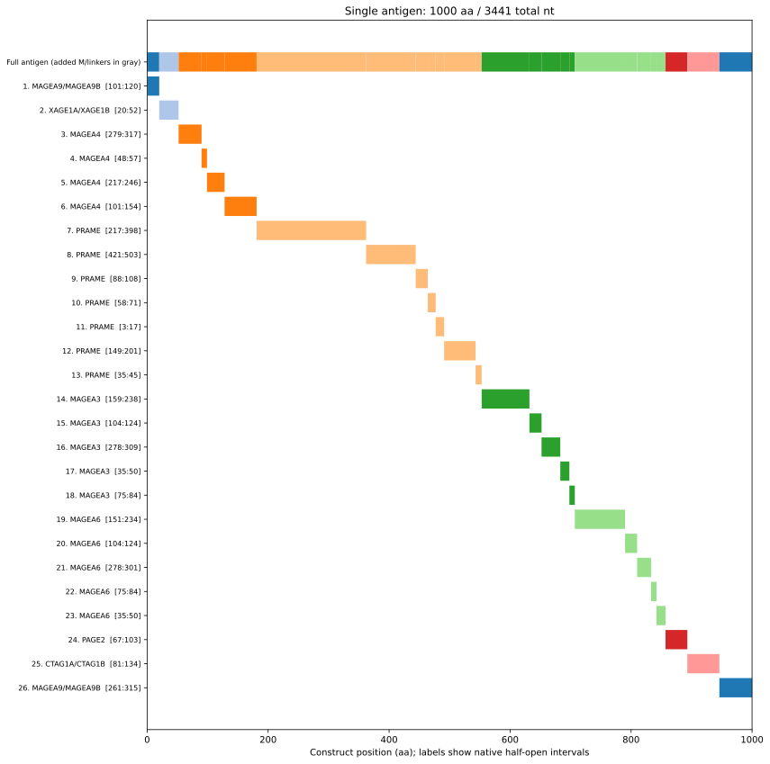
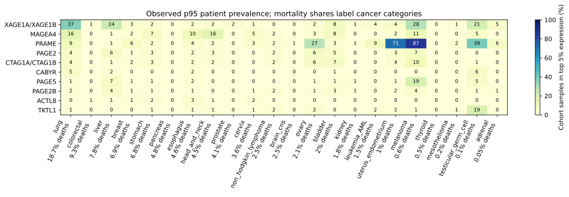
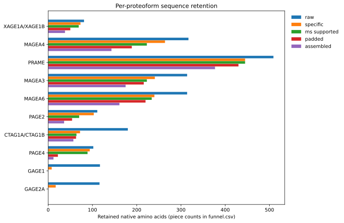
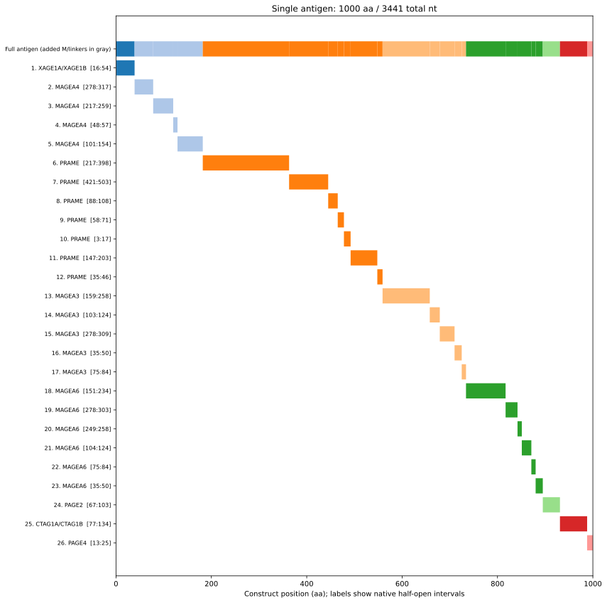

# Vaccine design validation (2026-10-07)

The current [Vaccine Atlas](vaccine-results/index.html) compares strict and
loose CTA definitions with either a length budget or ten contributing
proteoforms. MAGEA4 is the only eligible MAGE-family target. All designs use
actual MHCflurry/Pepsickle predictions and source-verified nonmalignant
heart/brain/lung HLA-I exclusions at one distinct donor.

| Design | Proteoforms | Native pieces | Protein aa | Total RNA nt | Distinct MS peptides | Peptide–HLA pairs | Supported panel alleles | Remaining junction predictions <1000 nM |
| --- | --- | --- | --- | --- | --- | --- | --- | --- |
| Strict budget | 22 | 30 | 1000 | 3441 | 94 | 451 | 54/54 | 1147 |
| Loose budget | 32 | 42 | 1000 | 3441 | 133 | 698 | 54/54 | 2026 |
| Strict ten | 10 | 20 | 999 | 3438 | 109 | 595 | 50/54 | 403 |
| Loose ten | 10 | 20 | 1000 | 3441 | 109 | 583 | 51/54 | 490 |

Counts deduplicate identical protein sequences, exact observed peptides and
peptide–HLA pairs separately. Predicted assignments are labeled apart from
measured monoallelic restrictions. These are MS-observed ligands, not
T-cell-validated epitopes or clinical patient coverage. All constructs still
require junction review; increasing protein breadth increased the number of
remaining predicted junction binders in these budget examples.

The primary Atlas 2020.12 rows establish `AETSYVKV`, `LAETSYVKV` and
`ALAETSYVKV` in donor AUT01-DN11 heart tissue. The
[study](https://doi.org/10.1136/jitc-2020-002071) describes nonmalignant primary
autopsy tissues from donors without diagnosed cancer, who could have other
diseases. Every covered 8-mer is excluded. The MAGEA4 maps show native sequence,
specificity subtraction, the normal-MS gate and chosen pieces with cancer and
normal-tissue observations overlaid. Absence of an observed hit does not
establish tissue absence or safety.

CT83 passes specificity and MS filtering under both definitions: 113 aa remain
with four qualifying observed peptides and the same mortality score. It is
retained by the strict ten-protein design, remains unscreened after the loose
ten-protein target is reached, and loses the marginal-gain allocation in both
budget designs. These outcomes distinguish definition, evidence and allocation.

Inputs use Hitlist 1.65.1, OncoRef 1.8.207 and Ensembl r112. The raw evidence
scan covers full candidate protein sequences and both legacy assay partitions.
Explicit non-MS and negative records are excluded. The broader Atlas audit
also checks longer source ligands sharing only an 8-mer; its additional matches
were already removed by the non-CTA background, so the model designs are
unchanged. Original model execution metadata is preserved when rendering.

Independent checks verify translation and total lengths, every source/output
hash, exact native/assembled peptide coordinates, sample-allele assignments,
every final junction window, non-CTA sequence specificity and all 70,142
qualifying primary tissue 8-mers, including synthetic junctions. Every website
prefix has independently calculated HLA probabilities and cancer union bounds
using the primary CIWD Table A2 values. Validation summaries, source rows,
figures and tables are available in each design's website downloads.

## Archived ten-protein examples (2026-10-06)

The following snapshots precede the verified normal-MS exclusion and broader
assay-partition audit. They retain cardiac peptide sequences removed from the
current designs. Use the linked Atlas above for the current comparison.

These strict and loose designs contain **ten contributing CTA proteoforms**,
with every other MAGE-family member excluded. Selection remains ordered by
individual global mortality × p95 expression-prevalence score. Identical full
protein sequences consume one slot. Unsupported candidates are explicitly
backfilled in `supported` mode; one whole ligand-bearing piece per target is
reserved before allocating additional pieces.

This replaces the previous provisional examples affected by
[Hitlist #644](https://github.com/pirl-unc/hitlist/issues/644).
Tsarina 1.33.1 independently requires positive MS modality and preserves rejected
fluorescence, biochemical and structural assay records. The exact peptide must
be MS-observed. In this run every sample panel allele with predicted affinity
below **1000 nM** qualifies; untyped MS may use panel predictions. There is no
best-of-haplotype or presentation-percentile gate. Allele inference is labeled
separately from monoallelic measurements. See the [method guide](vaccine-design.md).

MAGEA4 is the target of FDA-approved
[TECELRA](https://www.fda.gov/vaccines-blood-biologics/cellular-gene-therapy-products/tecelra).
That approval is the eligibility rationale, not approval of this vaccine.

Both runs use Hitlist 1.64.7, OncoRef 1.8.207, Ensembl r112, actual MHCflurry and
human-only in-vivo Pepsickle; 22 mortality categories, 27 cohorts and 9,064
samples. The categories represent **85.95%** of reference world mortality.
That is input reference coverage, not vaccine patient coverage. RNA includes
HBB/HBB_FI UTRs and a 120-nt polyA tract, with caps of **1000 aa / 3500 total nt**.
Padding is 0–10 aa in steps of 2, beam width 6 and ten search rounds.

## Evidence source and verification

The new fresh scoped raw scan covers the union of native 8–11-mers from the first
60 eligible positive-score candidates per definition. It does not reuse the old
top-ten-only evidence snapshot or a stale global observations cache. Released
Hitlist classification, MS/binding partition, deduplication, curated exclusions
and human class-I filtering are followed by Tsarina's positive-MS check.
The expanded nonbinding queried pool has **898 records for 361 peptide sequences**;
this pool includes non-MS records which the vaccine subsequently rejects.
[Source snapshots](vaccine-example/source-snapshots.json) record source hashes,
logical row locators, contributor counts and candidate scope.

Independent validation checks ten contributing full-sequence groups, exclusions,
MS modality, sample-allele assignments, native/assembled ligand coordinates,
every final junction-window/allele pair, translation, complete length arithmetic,
artifact hashes and absence of retained native 8-mers in every independent
non-CTA translated source. Full runtime audits remain under
`vaccine-designs/magea4-ten-2026-10-06/`; the selected-data snapshots below are
bundled with the release.

**Both constructs require junction review.** Remaining predictions below
1000 nM are not proof of presentation or immunogenicity; a reduced count does
not establish a junction-free antigen. The strict rejection option is
`--require-clean-junctions`.

## Strict design

**1000 aa / 3441 total nt; ten proteoforms in 20 native pieces.** Below-1000 nM junction-window/allele predictions: **1068 → 517**.

Verified retained evidence: **113 distinct peptide sequences**, **639 distinct peptide–HLA assignments**, **51/54 panel alleles**. Highest evidence tiers per distinct pMHC: 28 monoallelic, 202 sample-allele inferred and 409 untyped panel-inferred. Queried accepted MS records: 422; rejected non-MS/unknown records: 11.

| Rank | Proteoform | Full aa | Score |
| --- | --- | --- | --- |
| 1 | XAGE1A/XAGE1B | 81 | 0.099315 |
| 2 | MAGEA4 | 317 | 0.052540 |
| 3 | PRAME | 509 | 0.049262 |
| 6 | PAGE2 | 111 | 0.020858 |
| 7 | CTAG1A/CTAG1B | 180 | 0.019119 |
| 11 | PAGE5 | 130 | 0.011587 |
| 12 | PAGE2B | 111 | 0.011204 |
| 17 | ACTL8 | 366 | 0.006440 |
| 19 | TKTL1 | 596 | 0.005531 |
| 25 | CT83 | 113 | 0.004209 |

[Selection / all source IDs](vaccine-example/strict/selection.csv) · [All candidate outcomes](vaccine-example/strict/selection_screen.csv) · [Cancer incidence/mortality/p95](vaccine-example/strict/cancer_summary.csv) · [Cohort denominators](vaccine-example/strict/cancer_cohorts.csv)

| Proteoform | Full aa | Specific aa | MS interval aa | Max-padding aa | Assembled aa | Pieces | Distinct MS peptides | Distinct pMHC |
| --- | --- | --- | --- | --- | --- | --- | --- | --- |
| XAGE1A/XAGE1B | 81 | 73 | 69 | 50 | 50 | 1 | 2 | 11 |
| MAGEA4 | 317 | 252 | 210 | 176 | 144 | 4 | 31 | 122 |
| PRAME | 509 | 445 | 445 | 430 | 399 | 7 | 56 | 437 |
| PAGE2 | 111 | 97 | 64 | 54 | 40 | 1 | 3 | 3 |
| CTAG1A/CTAG1B | 180 | 72 | 64 | 53 | 53 | 1 | 7 | 7 |
| PAGE5 | 130 | 116 | 64 | 35 | 29 | 1 | 2 | 3 |
| PAGE2B | 111 | 97 | 64 | 54 | 54 | 1 | 3 | 3 |
| ACTL8 | 366 | 355 | 355 | 350 | 137 | 1 | 6 | 14 |
| TKTL1 | 596 | 553 | 475 | 284 | 29 | 2 | 2 | 2 |
| CT83 | 113 | 113 | 113 | 84 | 64 | 1 | 4 | 40 |

MS interval length includes the full qualifying native interval before terminal trimming. Peptide and pMHC counts can overlap between different proteins, and inferred alleles can share one observed peptide. They are not independent observations or patients.

[Full funnel](vaccine-example/strict/funnel.csv) · [Specific intervals](vaccine-example/strict/specific_intervals.csv) · [Native/assembled ligands](vaccine-example/strict/ligands.csv) · [Per-allele counts/tiers](vaccine-example/strict/hla_support_counts.csv) · [Observation-to-allele assignments](vaccine-example/strict/ms_assignments.csv)

[Accepted queried MS observations (gzipped CSV)](vaccine-example/strict/queried_ms_observations.csv.gz) · [Rejected assay records](vaccine-example/strict/rejected_ms_observations.csv) · [HLA frequency/provenance audit](vaccine-example/strict/hla_panel.csv)

[Construct layers](vaccine-example/strict/layers.csv) · [Remaining binders](vaccine-example/strict/junction-binders.csv) · [All junction predictions (gzipped CSV)](vaccine-example/strict/junctions.csv.gz) · [Cleavage](vaccine-example/strict/cleavage.csv) · [Length exclusions](vaccine-example/strict/excluded_segments.csv) · [Search history](vaccine-example/strict/search_history.csv)

[Protein FASTA](vaccine-example/strict/protein.fasta) · [CDS/stop FASTA](vaccine-example/strict/cds.fasta) · [Full RNA FASTA](vaccine-example/strict/full.fasta) · [Configuration / versions / independent checks / hashes](vaccine-example/strict/validation.json)

## Loose design

**1000 aa / 3441 total nt; ten proteoforms in 20 native pieces.** Below-1000 nM junction-window/allele predictions: **1232 → 656**.

Verified retained evidence: **113 distinct peptide sequences**, **627 distinct peptide–HLA assignments**, **52/54 panel alleles**. Highest evidence tiers per distinct pMHC: 27 monoallelic, 199 sample-allele inferred and 401 untyped panel-inferred. Queried accepted MS records: 425; rejected non-MS/unknown records: 13.

| Rank | Proteoform | Full aa | Score |
| --- | --- | --- | --- |
| 1 | XAGE1A/XAGE1B | 81 | 0.099315 |
| 2 | MAGEA4 | 317 | 0.052540 |
| 3 | PRAME | 509 | 0.049262 |
| 6 | PAGE2 | 111 | 0.020858 |
| 7 | CTAG1A/CTAG1B | 180 | 0.019119 |
| 12 | CABYR | 493 | 0.012576 |
| 13 | PAGE5 | 130 | 0.011587 |
| 14 | PAGE2B | 111 | 0.011204 |
| 20 | ACTL8 | 366 | 0.006440 |
| 22 | TKTL1 | 596 | 0.005531 |

[Selection / all source IDs](vaccine-example/loose/selection.csv) · [All candidate outcomes](vaccine-example/loose/selection_screen.csv) · [Cancer incidence/mortality/p95](vaccine-example/loose/cancer_summary.csv) · [Cohort denominators](vaccine-example/loose/cancer_cohorts.csv)

| Proteoform | Full aa | Specific aa | MS interval aa | Max-padding aa | Assembled aa | Pieces | Distinct MS peptides | Distinct pMHC |
| --- | --- | --- | --- | --- | --- | --- | --- | --- |
| XAGE1A/XAGE1B | 81 | 73 | 69 | 50 | 50 | 1 | 2 | 11 |
| MAGEA4 | 317 | 264 | 223 | 189 | 152 | 4 | 32 | 123 |
| PRAME | 509 | 445 | 445 | 430 | 383 | 7 | 56 | 437 |
| PAGE2 | 111 | 103 | 70 | 54 | 40 | 1 | 3 | 3 |
| CTAG1A/CTAG1B | 180 | 72 | 64 | 53 | 53 | 1 | 7 | 7 |
| CABYR | 493 | 477 | 292 | 120 | 108 | 1 | 3 | 27 |
| PAGE5 | 130 | 122 | 70 | 35 | 17 | 1 | 2 | 3 |
| PAGE2B | 111 | 103 | 70 | 54 | 48 | 1 | 3 | 3 |
| ACTL8 | 366 | 355 | 355 | 350 | 129 | 1 | 6 | 14 |
| TKTL1 | 596 | 553 | 475 | 284 | 19 | 2 | 2 | 2 |

MS interval length includes the full qualifying native interval before terminal trimming. Peptide and pMHC counts can overlap between different proteins, and inferred alleles can share one observed peptide. They are not independent observations or patients.

[Full funnel](vaccine-example/loose/funnel.csv) · [Specific intervals](vaccine-example/loose/specific_intervals.csv) · [Native/assembled ligands](vaccine-example/loose/ligands.csv) · [Per-allele counts/tiers](vaccine-example/loose/hla_support_counts.csv) · [Observation-to-allele assignments](vaccine-example/loose/ms_assignments.csv)

[Accepted queried MS observations (gzipped CSV)](vaccine-example/loose/queried_ms_observations.csv.gz) · [Rejected assay records](vaccine-example/loose/rejected_ms_observations.csv) · [HLA frequency/provenance audit](vaccine-example/loose/hla_panel.csv)

[Construct layers](vaccine-example/loose/layers.csv) · [Remaining binders](vaccine-example/loose/junction-binders.csv) · [All junction predictions (gzipped CSV)](vaccine-example/loose/junctions.csv.gz) · [Cleavage](vaccine-example/loose/cleavage.csv) · [Length exclusions](vaccine-example/loose/excluded_segments.csv) · [Search history](vaccine-example/loose/search_history.csv)

[Protein FASTA](vaccine-example/loose/protein.fasta) · [CDS/stop FASTA](vaccine-example/loose/cds.fasta) · [Full RNA FASTA](vaccine-example/loose/full.fasta) · [Configuration / versions / independent checks / hashes](vaccine-example/loose/validation.json)

## Coverage interpretation

The objective ranks individual additive mortality-weighted prevalence scores; it does not maximize a distinct-patient union. The selected cancer tables provide every individual p95 fraction and its cohort denominator. Exact patient overlap and clinical vaccine coverage are not inferred. HLA frequencies are regional proxy evidence, and many assigned alleles are predictions. Absolute incidence/death counts remain missing wherever OncoRef lacks sourced counts. Shares are percentages, p95 prevalence is a fraction.
